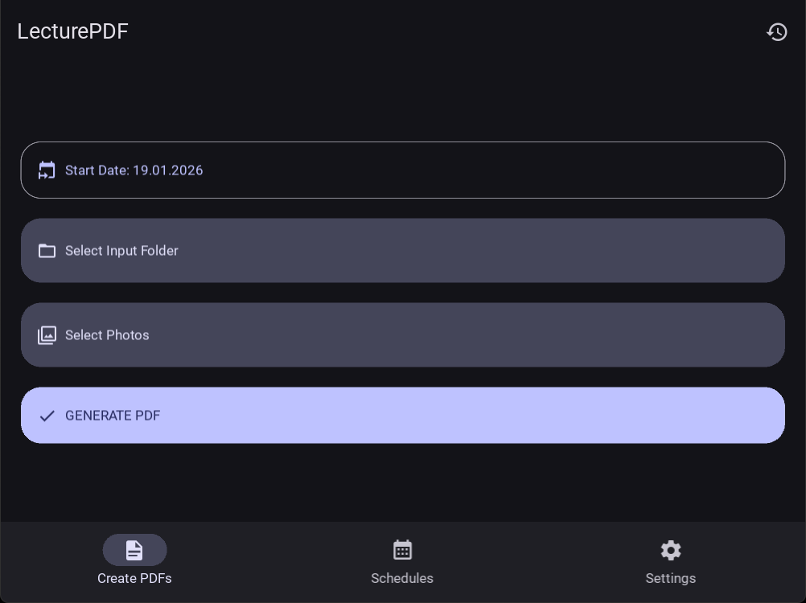
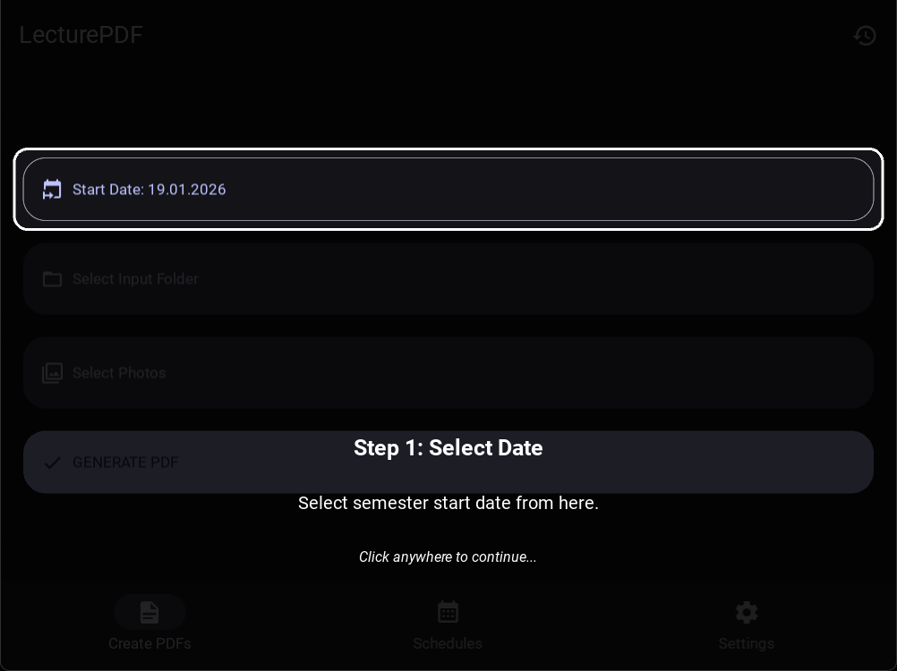
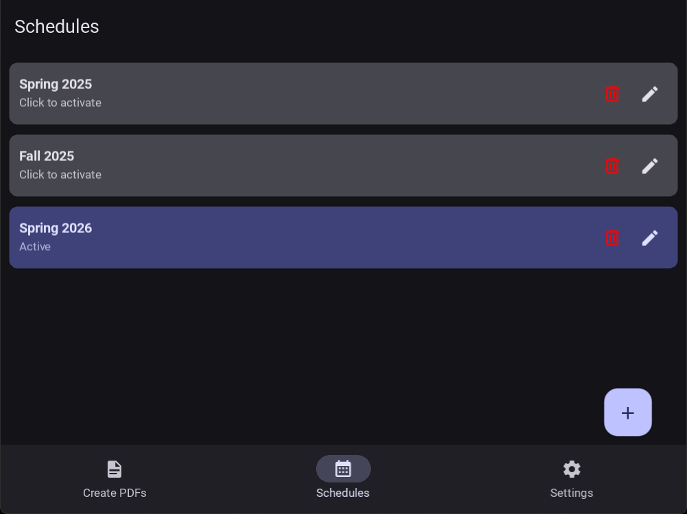
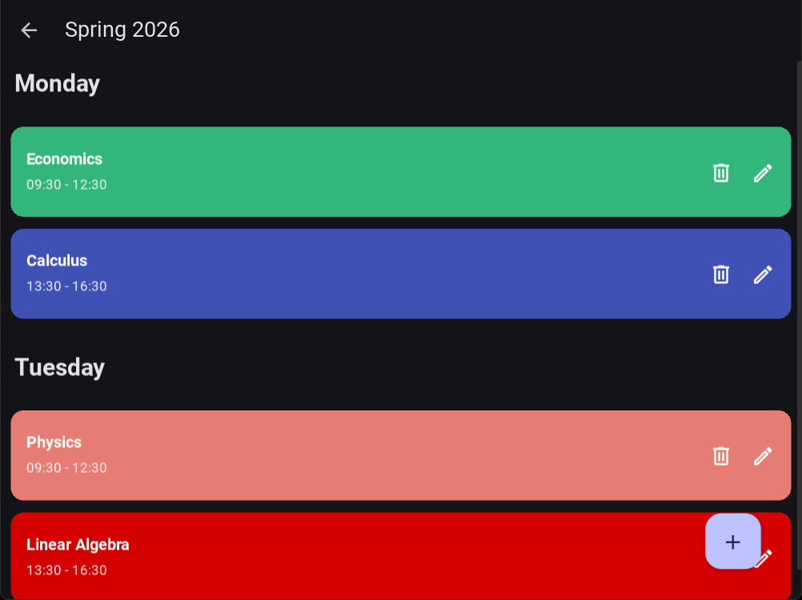
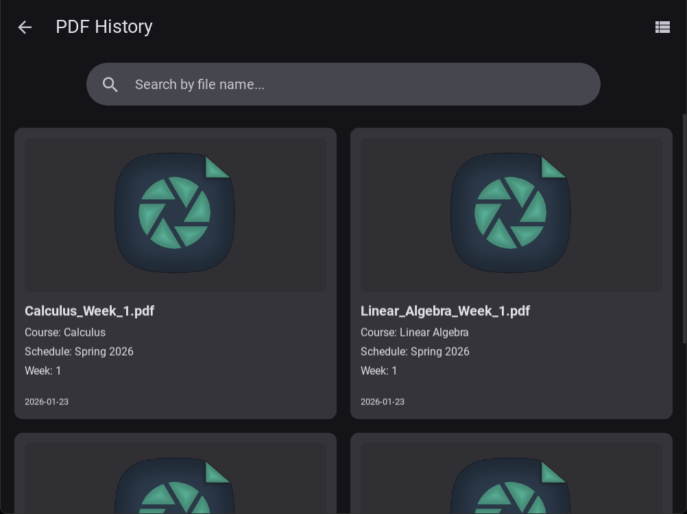
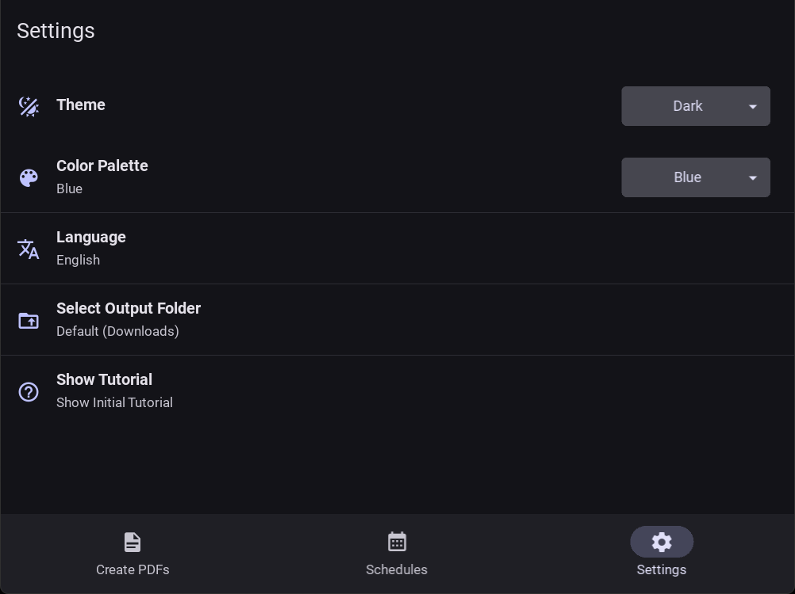

<p align="center"></p>
<h1 align="center">LecturePDF</h1>
<p align="center">
  Automatically organize and convert your photos into PDF documents
</p>


---

## About

**LecturePDF** is a cross-platform desktop application and command-line tool built for students who take photos during lectures. LecturePDF automates the process of grouping your captures by class schedules and weeks, and compiles them into PDF documents.

By matching the **EXIF timestamp** of your photos against a customizable class schedule and a semester start date, LecturePDF knows exactly which course the photos belong to and automatically handles the organization for you.

## Features

- Material Design 3 GUI built with KivyMD, and a Command-Line Interface.
- Extracts EXIF timestamp from your photos and automatically arranges them to match your class schedule.
- Keeps track of your generated PDFs using a local SQLite database.
- Supports Light/Dark mode and different color palettes.
- Built-in multi-language support.

## Upcoming Features

- Android, MacOS and iOS support
- Enhanced PDF Filtering
- Optional OpenCV Integration
- Optional OCR Integration

## Screenshots

<p align="center">
  
  
</p>
<p align="center">
  
  
</p>
<p align="center">
  
  
</p>

## Installation

Download the compiled executable for your operating system from the latest [Release](https://github.com/a-emre-ergun/LecturePDF/releases/latest).

## Usage

### Desktop Application

Double-click the `LecturePDF` executable to launch the app.

1. Set up your schedule in the Schedules tab.
2. Select your Semester Start Date.
3. Choose the folder containing your photos, or select specific photos.
4. Click Generate PDF.

### Command Line Interface (CLI)

Call the CLI executable from your terminal:

```powershell
lecturepdf-cli --semester-start YYYY-MM-DD [OPTIONS]
```

To use the CLI, you need to provide a JSON file containing your weekly schedule. See [sample_schedule.json](examples/sample_schedule.json) for the structure.

**Available Options:**
- `-pf`, `--photos-folder`: Path to the folder containing photos (Default: `./input`)
- `-sf`, `--schedule-file`: Path to your schedule JSON file (Default: `schedule.json`)
- `-of`, `--output-folder`: Path of the output folder for PDFs (Default: `output`)
- `-ss`, `--semester-start`: (Required) Semester start date in `YYYY-MM-DD` format.
- `-q`, `--quiet`: Disables verbose output.